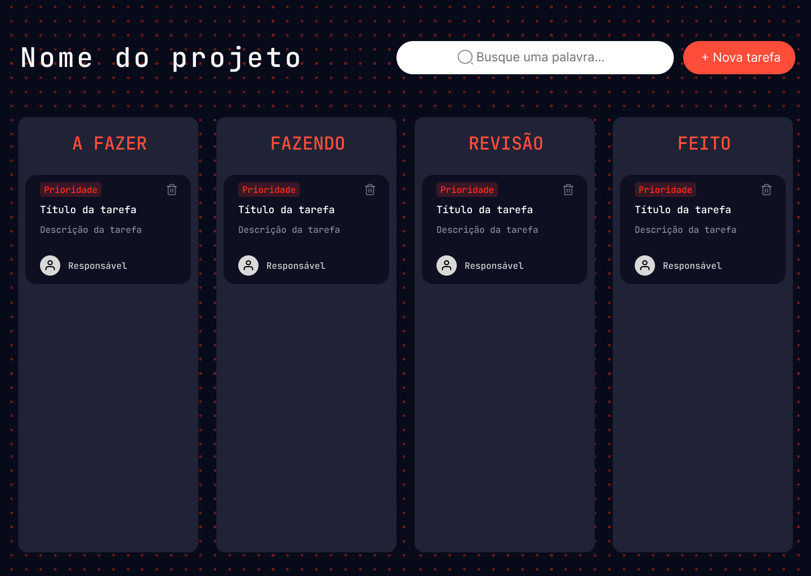

# Documentação Individual: Tela do Kanban
**Responsável:** Fabianne Jesus Silva Leite

---

## 1. Wireframe

### Descrição do Design
**Ferramenta utilizada:** Figma.

 O wireframe foi desenvolvido no Figma com o objetivo de planejar a estrutura visual da tela antes da implementação em código. A organização dos elementos foi baseada no modelo de quadro Kanban, priorizando a visualização clara do fluxo de tarefas por meio de colunas representando diferentes status, como “A Fazer”, “Fazendo”, “Revisão” e “Concluído”.

Para a construção do design, utilizei como referência o site da empresa [Inteli Júnior](https://intelijunior.com/), buscando manter uma identidade visual próxima ao padrão da organização. A partir dessa referência, considerei aspectos como:

- **Hierarquia visual clara:** título e ações principais (criar tarefa e buscar) ficam no topo.  
- **Facilidade de uso:** ações comuns (criar, buscar, mover tarefas) são acessíveis e intuitivas.  
- **Escaneabilidade:** cards organizados verticalmente facilitam leitura rápida.  
- **Feedback visual:** mudanças de estado são refletidas imediatamente na interface.  
- **Cores:** o uso de tons de azul, preto, cinza e laranja, gera promixidade com a identidade visual da empresa.

Assim, o uso do Figma permitiu validar a disposição dos elementos antes da implementação, reduzindo erros e retrabalho durante o desenvolvimento.

### Visual do Wireframe

---

## 2. Funcionalidades do Componente

### Ação principal

O componente tem como principal função **gerenciar tarefas em um quadro Kanban dinâmico**, permitindo visualizar, criar, atualizar e organizar tarefas de acordo com seu status.

### Funcionalidades detalhadas

#### Renderização de tarefas
- As tarefas são carregadas a partir de uma API externa.  
- Cada tarefa é exibida como um card dentro da coluna correspondente ao seu status.  
- O sistema atualiza automaticamente a interface ao carregar os dados.  

#### Criação de tarefas
- Através de um botão de ação (Criar tarefa), o usuário pode abrir um formulário/modal.  
- Os dados inseridos são enviados para a API.  
- Após criação, a tarefa aparece automaticamente na coluna "A fazer" do quadro.  

#### Busca e filtragem
- Campo de busca permite filtrar tarefas em tempo real.  
- A busca pode considerar:
  - Título  
  - Responsável  
  - Prioridade  
- Melhora a navegação em grandes volumes de tarefas.  

#### Movimentação de tarefas (Drag and Drop)
- O usuário pode arrastar cards entre colunas.  
- Essa ação altera o status da tarefa.  
- A mudança é refletida visualmente e persistida na API.  

#### Atualização dinâmica
- Sempre que há alteração (criação, movimentação ou exclusão), a interface é atualizada sem recarregar a página.  

#### Exclusão de tarefas
- O ícone de lixeira permite remover tarefas.  
- A ação dispara uma requisição para a API.  
- O card é removido da interface após confirmação.  

---

## 3. Dependências Necessárias

### HTML
- Utilização de **HTML5 semântico** para estruturar a aplicação.
- Divisão principal:
  - `header` → título, busca e botão de criar tarefa  
  - `main` → área do quadro Kanban  
- Estrutura em colunas com `div.kanban-column` e `data-status` para representar o status das tarefas.
- Uso de **IDs** para integração com JavaScript (colunas, busca, modal e formulário).
- Implementação de **modal** com formulário para criação de tarefas.

### JavaScript
- Utilizado para controle da lógica da aplicação.
- Consumo de API utilizando `fetch` (requisições GET, POST, PATCH e DELETE).
- Manipulação do DOM para renderizar tarefas dinamicamente nas colunas.
- Gerenciamento de estado local com um array de tarefas (`tasks`).
- Implementação das principais funcionalidades:
  - Criação de tarefas  
  - Exclusão de tarefas  
  - Atualização de status via drag and drop  
  - Filtro de busca em tempo real  
- Uso de **event listeners** para interações do usuário (cliques, submit, input e drag and drop).

### CSS
- Utilizado para estilização da interface.
- Componentes principais:
  - Cards de tarefas  
  - Colunas do Kanban  
  - Modal de criação  
  - Botões e formulário  

### Dados (API)

A aplicação depende de uma API externa para persistência e manipulação dos dados.

**Endpoints utilizados:**
- `GET /tasks` → listar tarefas  
- `POST /tasks` → criar tarefa  
- `PATCH /tasks/:id` → atualizar status ou conteúdo  
- `DELETE /tasks/:id` → remover tarefa  

**Campos utilizados:**

- `id` → identificador único da tarefa  
- `title` → título da tarefa (exibido no card)  
- `description` → descrição detalhada da tarefa  
- `status` → define a coluna em que a tarefa será exibida  
- `priority` → nível de prioridade (usado para estilização visual)  
- `assignee` → responsável pela tarefa  

**Campos adicionais (utilizados na criação, mas não exibidos atualmente):**
- `dueDate` → data de entrega da tarefa  
- `estimatedHours` → estimativa de tempo para conclusão  
- `projectId` → identificador do projeto ao qual a tarefa pertence  

### Bibliotecas Externas
- **Lucide Icons**: Utilizado para ícones (lixeira, adicionar, busca, etc.).  

- **Google Fonts (JetBrains Mono)**: Padronização visual e melhoria da legibilidade.

---

## 4. Uso de IA

**Ferramenta**: AI Studio, utilizada como suporte em diferentes etapas do desenvolvimento:

#### Estruturação inicial do HTML
- Geração da base da página (header, colunas e cards).  

#### Organização do layout
- Sugestões de estrutura para o quadro Kanban.  
- Distribuição dos elementos na tela.  

#### Auxílio no JavaScript
- Criação inicial de funções para consumo da API.  
- Lógica de renderização das tarefas.  
- Manipulação do DOM.  

### Considerações

O uso da IA contribuiu significativamente para acelerar o desenvolvimento inicial, principalmente na construção da estrutura base e na organização do código. No entanto, o código gerado não estava totalmente pronto para uso, sendo necessário realizar diversos ajustes manuais.

Entre os principais pontos de intervenção manual:

- Correção de bugs (como problemas na exclusão de tarefas e renderização incorreta).  
- Adaptação das funções para integração correta com a API utilizada.  
- Melhor organização do código para manter legibilidade e manutenção futura.  
- Ajustes de design para seguir o padrão previamente construído e a identidade visual da empresa.

Dessa forma, a IA foi utilizada como uma ferramenta de apoio, mas o entendimento da lógica e a capacidade de depuração foram essenciais para a finalização do componente.