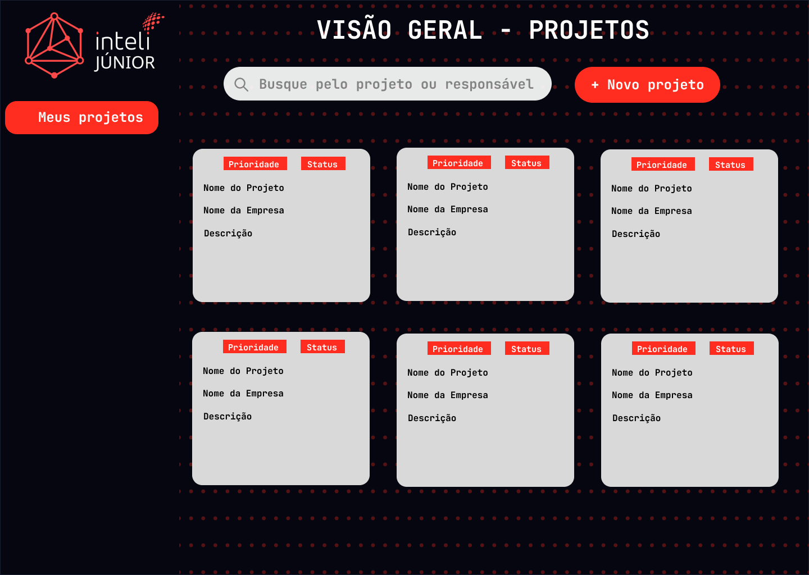

# Documentação Individual: Dashboard de projetos
**Responsável:** Vanessa Carli de Andrade

---

## 1. Wireframe

### Descrição do design
* **Ferramenta utilizada:** Figma
* **Conceito:** O design foi diretamente inspirado na identidade visual do site da Inteli Júnior, adotando uma estética Dark Mode moderna, tecnológica e voltada para a produtividade. A paleta de cores foca em tons escuros para o fundo, com contrastes fortes em branco para leitura e o vermelho característico da Inteli Júnior como cor de destaque (botões, barras de progresso e background texturizado com pontos).
* **Organização:** A interface apresentada no wireframe foca na funcionalidade do Dashboard. Nota-se uma barra de navegação lateral (sidebar) que foi incluída no design apenas como um guia conceitual para o avaliador compreender a visão futura do projeto, não fazendo parte da implementação atual.

* **Estrutura do Dashboard:**

    * Barra Superior: Contém o título "Visão Geral", um campo de busca para filtrar projetos e o botão de ação principal "+ Novo projeto".

    * Grid de Projetos: Os projetos são organizados em uma malha de cards retangulares que priorizam a hierarquia da informação.

    * Design do Card: Cada card apresenta, no canto superior direito, duas tags para identificação rápida de Prioridade e Status. O corpo do card exibe o Nome do Projeto em destaque, o Nome da Empresa/Cliente e uma Descrição detalhada do escopo.

    * Interface de Cadastro: Ao acionar o botão de criação, uma janela sobreposta é aberta, contendo um formulário estruturado para coletar todos os dados necessários do novo projeto de forma organizada.

### Visual do Wireframe

---

## 2. Funcionalidades do componente desenvolvido

* **Ação principal:** Listagem dinâmica de projetos e gerenciamento de novos cadastros através de uma interface intuitiva.

* **Interações:**
    * **Busca e Filtragem:** O usuário pode filtrar os cards em tempo real através da barra de pesquisa por nome do projeto ou responsável.

    * **Criação de Projetos:** Abertura de uma janela de formulário ao clicar em "+ Novo projeto", permitindo o input de dados como cliente, descrição, prioridade e prazos.

    * **Feedback Visual:** Efeitos de hover nos cards para indicar interatividade e barras de progresso que refletem o status atual de cada entrega.
---

## 3. Dependências Necessárias

* **Estrutura:** HTML5 semântico (uso de tags como <main>, <section>, e <header>).

* **Estilização:** CSS3 puro, utilizando:

* **CSS Variables:** Para padronização das cores institucionais.

* **CSS Grid:** Para a organização responsiva da malha de projetos.

* **Flexbox:** Para o alinhamento interno dos elementos do card e a estruturação do formulário no modal.

* **Comportamento:** JavaScript Vanilla (ES6+) para manipulação do DOM, controle de abertura/fechamento do modal e lógica de renderização dos cards com base em dados.

* **Tipografia:** Google Fonts (JetBrains Mono) para manter a estética técnica e moderna.

---

## 4. Uso de IA

**Exemplo:**

* **Ferramenta utilizada:** Gemini
* **Finalidade:** [Seja específico. Exemplos abaixo:]
    * **Refatoração de Layout:** Suporte no ajuste de CSS para garantir que a barra de pesquisa e os títulos estivessem perfeitamente alinhados, além de remover elementos visuais duplicados ou desnecessários.
    * **Lógica de Badges:** Auxílio na criação da lógica JavaScript que atribui cores e textos específicos às etiquetas de status e prioridade dentro dos cards.
    * **Refino de UI:** Sugestões de propriedades CSS para polir o acabamento visual da interface e garantir que o design se assemelhasse ao padrão da Inteli Júnior.
    * **Documentação:** Auxílio na criação da estrutura e revisão do texto.
* **Reflexão:** O uso da IA foi fundamental para acelerar o desenvolvimento das regras de estilo e resolver pequenos erros de alinhamento. Ela permitiu que eu focasse na experiência do usuário e na organização da informação, enquanto as sugestões técnicas garantiram que o código seguisse boas práticas de layout

---